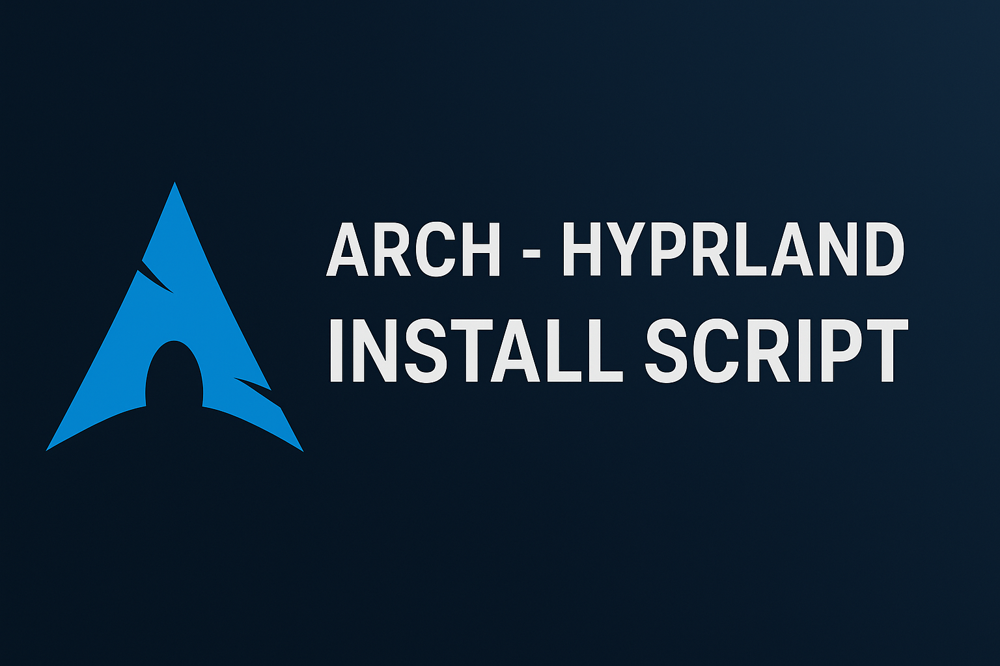

<p align="center">
  
</p>

<h1 align="center">🛠️ Arch - Hyprland Install Script</h1>

<p align="center">
  <a href="https://archlinux.org/">
    
  </a>
  <a href="https://github.com/hyprwm/Hyprland">
    
  </a>
  <a href="https://github.com/hetfs/Arch-hyprland/stargazers">
    
  </a>
  <a href="https://github.com/hetfs/Arch-hyprland/blob/main/LICENSE">
    
  </a>
</p>

Automate your **Arch Linux + Hyprland** setup with a fast, production-ready desktop environment. Get from zero to Hyprland in minutes—not hours.

---

## ✨ Features

* ✅ Automated Arch + Hyprland installation
* ✅ Curated package selection for performance and usability
* ✅ Centralized dotfile management via [Hyprland-Dots](https://github.com/hetfs/Hyprland-Dots)
* ✅ Hardware-aware setup (NVIDIA, Intel, AMD support)
* ✅ Themed components (SDDM, GTK, icons, cursors)

---

## ⚠️ Exclusions

* ❌ Custom dotfiles/configurations (pulled separately from [Hyprland-Dots](https://github.com/hetfs/Hyprland-Dots)
* ❌ Personal data or user customizations
* ❌ Hands-free unattended installs (some manual choices required)

---

## 🛡️ Pre-Installation

### 🔐 Backup First

Use `timeshift` or `snapper` to create a restore point. This script makes **major system changes**—a backup is non-negotiable.

### 🖥️ Requirements

* Minimal **Arch Linux** installation (base/server type)
* `curl` installed (for auto-install method)
* Stable internet connection
* Script must be run from `$HOME` (or any user-owned directory)

---

## 🎧 Audio Setup

### Default: PipeWire

The script:

* Installs **PipeWire** (audio + video + Bluetooth)
* Removes and disables **PulseAudio**
* Ensures correct routing

If you prefer **PulseAudio**:

1. Edit `install.sh` and comment out `pipewire.sh`, or
2. Delete `install-scripts/pipewire.sh` before installation

---

## 🎮 NVIDIA Graphics

### Default:

* Installs **nvidia-dkms** (supports GTX 900+)
* Configures drivers + environment variables automatically

### Legacy Support:

* Edit `install-scripts/nvidia.sh` for older GPUs

⚠️ Important:

* Choosing NVIDIA in the installer blacklists **nouveau**
* To use **nouveau**, simply skip NVIDIA in the installer

---

## ⚡ Installation Methods

### Auto Install (recommended)

```bash
sh <(curl -fsSL https://raw.githubusercontent.com/hetfs/Arch-hyprland/main/auto-install.sh)
```

> 🐟 **Fish Shell Users**: Use manual install instead.

### Manual Install

```bash
git clone --depth=1 https://github.com/hetfs/Arch-hyprland.git ~/Arch-Hyprland
cd ~/Arch-Hyprland
chmod +x install.sh
./install.sh
```

---

## 🗑️ Uninstallation

```bash
./uninstall.sh
```

> ⚠️ May destabilize your system. Ensure you have a `timeshift` or `snapper` backup first.

---

## ✨ ZSH + Oh-My-ZSH Setup

```bash
chsh -s $(which zsh)
zsh
source ~/.zshrc
```

* Reboot or log out to apply
* Default theme: **agnosterzak** (external oh-my-zsh theme)
* Change themes:

  * Press `SUPER + SHIFT + O` → pick theme → restart terminal
  * Or manually edit `~/.zshrc` → update `ZSH_THEME="theme-name"`

---

## 📦 Custom Packages

To customize installed packages:

* Edit **`install-scripts/00-hypr-pkgs.sh`**

⚠️ Removing required packages may break the Hyprland Dots.

---

## 🚩 Switching to SDDM (from GDM)

Disable GDM:

```bash
sudo systemctl disable gdm.service
reboot
```

After reboot:

1. Log in via TTY

2. `cd ~/Arch-Hyprland`

3. Run:

   ```bash
   ./install.sh
   ```

4. Select **SDDM** and choose a theme

---

## 💫 Themes

* **SDDM theme** → [LINK](https://github.com/JaKooLit/simple-sddm-2) modified fork of [LINK](https://github.com/Keyitdev/sddm-astronaut-theme)
* **GTK + Icons** → [LINK](https://github.com/JaKooLit/GTK-themes-icons) includes **Bibata Modern Ice** cursor

---

## ⌨️ Keybindings

* [View Keybinds](https://github.com/hetfs/Arch-hyprland/wiki)
* In Hyprland: Press `SUPER + H`

---

## 🆘 Support

### Issues

File bugs here → [Arch-Hyprland Issues](https://github.com/hetfs/Arch-hyprland/issues)

---

## Community

* Check existing issues first
* Provide hardware specs + logs
* [Hyprland](https://hyprland.org/) → Window Manager
* [Arch Wiki](https://wiki.archlinux.org/) → Arch help

---

💾 **Remember:** With great automation comes great responsibility. Backup before you automate!

